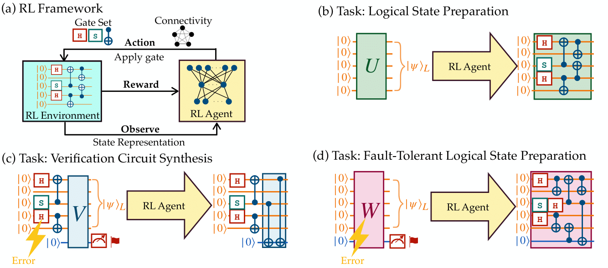

# rlftqc - Reinforcement Learning for Fault-Tolerant Quantum Circuit Discovery

[](https://arxiv.org/abs/1234.56789)

Code repository for quantum circuit discovery for fault-tolerant logical state preparation with reinforcement learning. 

- [Description](#description)
- [Installation](#installation)
- [Minimal Examples](#minimal-examples)
    1. [Logical State Preparation](#logical-state-preparation)   <a href="#"></a>
    2. [Verification Circuit Synthesis](#verification-circuit-synthesis)  <a href="#"></a>
    3. [Integrated Fault-Tolerant Logical State Preparation](#integrated-fault-tolerant-logical-state-preparation)  <a href="#"></a>
- [License](#license)
- [Citation](#citation)
  
## Description

This library can be used to train an RL agent for three different tasks:
1. **Logical State Preparation**: Prepare a logical state from a given stabilizer QEC code.
2. **Verification Circuit Synthesis**: Prepare a verification circuit from a given logical state preparation circuit based on flag-qubit protocols [1] to make the state preparation fault-tolerant.
3. **Integrated Fault-Tolerant Logical State Preparation**: Integrates the two tasks above to prepare a logical state fault-tolerantly.

For all the tasks, the user can specify the Clifford gate set and qubit connectivity. The folder <a href="circuits">`circuits`</a> shows circuit examples that the RL agent prepared. 




## Installation

1. Clone the repository

``` bash
git clone https://github.com/remmyzen/rlftqc.git
cd rlftqc
```

2. Install requirements
``` bash
pip install -r requirements.txt
```
## Minimal Examples

### Logical State Preparation  
<a href="#"></a>

For the logical state preparation task, you only need to specify the target stabilizers of your logical state. 

For example, the code below will train an RL agent to prepare the $|0\rangle_L$ of the 7-qubit Steane code. It uses $H$, $S$, and $CNOT$ gates and all-to-all qubit connectivity by default.

``` python
from rlftqc.logical_state_preparation import LogicalStatePreparation

target = ["+ZZZZZZZ", "+ZIZIZIZ", "+XIXIXIX", "+IZZIIZZ", "+IXXIIXX", "+IIIZZZZ", "+IIIXXXX"]

lsp = LogicalStatePreparation(target)
lsp.train()   ## Train the agent
lsp.run()     ## Run the agent to get the circuit
```

Refer to the notebook `notebooks/01 - Logical State Preparation.ipynb` for more advanced examples (e.g. change the gate set and qubit connectivity).

### Verification Circuit Synthesis  

<a href="#"></a>

For the verification circuit synthesis task, you only need to specify the encoding circuit as a `stim.Circuit` [(see reference)](https://github.com/quantumlib/Stim/blob/main/doc/python_api_reference_vDev.md#stim.Circuit) or `qiskit.QuantumCircuit` [(see reference)](https://docs.quantum.ibm.com/api/qiskit/qiskit.circuit.QuantumCircuit) instance. 

For example, the code below will train an RL agent to synthesize a verification circuit to prepare $|0\rangle_L$ of the 7-qubit Steane code fault-tolerantly. 

``` python
import stim
from rlftqc.verification_circuit_synthesis import VerificationCircuitSynthesis

## Encoding circuit for the $|0\rangle_L$ of the 7-qubit Steane code.
circ = stim.Circuit(""" H 0 1 3
CX 0 6 1 5 0 4 3 4 3 5 5 6 0 2 1 2 """)

## We can ignore Z error since we are preparing zero-logical of Steane code
vcs = VerificationCircuitSynthesis(circ, ignore_z_errors = True)  
vcs.train()   ## Train the agent
vcs.run()     ## Run the agent to get the circuit
```

Refer to the notebook `notebooks/02 - Verification Circuit Synthesis.ipynb` for more advanced examples.

### Integrated Fault-Tolerant Logical State Preparation
<a href="#"></a>
  
For the integrated logical state preparation task, you only need to specify the target stabilizers of your logical state. 

For example, the code below will train an RL agent to prepare the $|0\rangle_L$ of the 7-qubit Steane code fault-tolerantly. 

``` python
from rlftqc.ft_logical_state_preparation import FTLogicalStatePreparation

target = ["+ZZZZZZZ", "+ZIZIZIZ", "+XIXIXIX", "+IZZIIZZ", "+IXXIIXX", "+IIIZZZZ", "+IIIXXXX"]

## Create class
ftlsp = FTLogicalStatePreparation(target, ignore_z_errors=True)
ftlsp.train()   ## Train the agent
ftlsp.run()     ## Run the agent to get the circuit

```
Refer to the notebook `notebooks/03 - Integrated Fault-Tolerant Logical State Preparation.ipynb` for more advanced examples.

## License

The code in this repository is released under the MIT License.

## Citation
``` bib
@article{zen2024quantum,
  title={Quantum Circuit Discovery for Fault-Tolerant Logical State Preparation with Reinforcement Learning},
  author={},
  journal={arXiv:2402.xxxx},
  year={2024}
}
```

## References
[1] Chamberland, Christopher, and Michael E. Beverland. "Flag fault-tolerant error correction with arbitrary distance codes." Quantum 2 (2018): 53.

